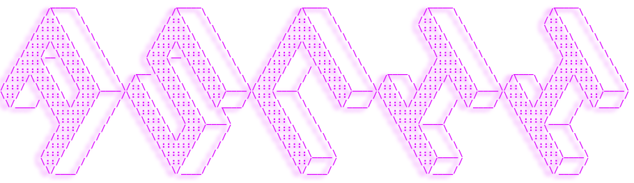
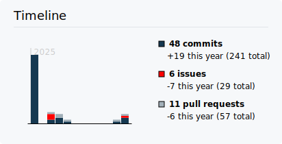
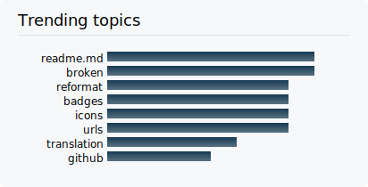
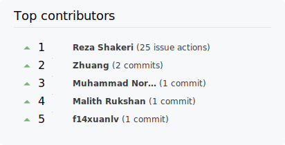
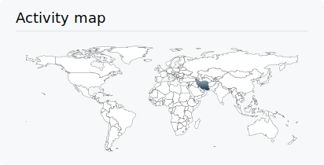
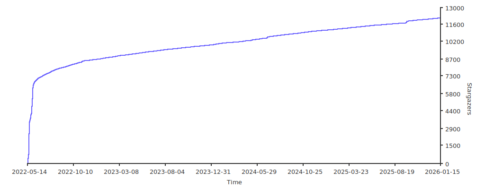
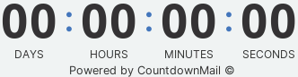
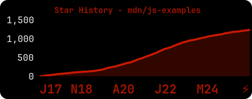

<p align="center">
  <a href="https://www.producthunt.com/posts/beautify-github-profile?utm_source=badge-featured&utm_medium=badge&utm_souce=badge-beautify&#0045;github&#0045;profile" target="_blank">
    
  </a>
  <a href="https://www.producthunt.com/posts/beautify-github-profile?utm_source=badge-top-post-badge&utm_medium=badge&utm_souce=badge-beautify&#0045;github&#0045;profile" target="_blank">
    
  </a>
  <a href="https://www.producthunt.com/posts/beautify-github-profile?utm_source=badge-review&utm_medium=badge&utm_souce=badge-beautify&#0045;github&#0045;profile#discussion-body" target="_blank">
    
  </a>
</p>
<p align="center">
  
  
  
  
  
  
  
  
</p>

---

سلام دوستان 🖐️  
حال شما چطور است؟ اگر می‌خواهید ظاهر پروفایل گیت‌هاب خود را زیباتر کنید، به مکان درستی آمده‌اید.

# 📖 فهرست مطالب
- [📌 قدم اول: راه‌اندازی مخزن گیت‌هاب ](#-قدم-اول-راهاندازی-مخزن-گیتهاب)
- [💡 از کجا ایده بگیریم؟ ?](#-از-کجا-ایده-بگیریم)
- [🚩 بعد از مشاهده پروفایل ها چکار کنیم؟?](#-بعد-از-مشاهده-این-پروفایلها-چه-کار-کنیم)
  - [🧩 نشان ها ](#-نشانها-)
  - [🛠️ ویجت ها ](#️-ویجتها-)
  - [✅ آیکون ها ](#-آیکون-ها-)
  - [⚙️ تولید کننده پروفایل ](#️-تولیدکننده-پروفایل-)
  - [😉 شکلک ها (ایموجی) ](#-شکلک-ها-ایموجی-ها)
- [یک ستاره بدهید ⭐](#یک-ستاره-بدهید-)

# 📌 قدم اول: راه‌اندازی مخزن گیت‌هاب  
یک مخزن با نام کاربری گیت‌هاب خود بسازید 👇


الگو : 👇
```
https://github.com/username/username
```

مثال : 👇
```
https://github.com/rzashakeri/rzashakeri
```

### پس از ساخت مخزن، **یک فایل README.md** در مخزن ایجاد کنید و تمام ✅  
حالا که مخزن ساخته شد، به قسمت جالب می‌رسیم: **طراحی فایل README.md خودمان.**


# 💡 از کجا ایده بگیریم؟  
حتماً از شما پرسیده شده که از کدام پروفایل‌ها برای گرفتن ایده استفاده کنید؟ شما می‌توانید پروفایل افراد مختلف را از طریق سایت زیر مشاهده کنید و از آن‌ها ایده بگیرید 👇

### [🔗 پروفایل گیت‌هاب جالب](https://zzetao.github.io/awesome-github-profile/)

# 🚩 بعد از مشاهده این پروفایل‌ها چه کار کنیم؟  
خب، تا اینجا توانسته‌اید ایده‌های جالبی از پروفایل‌های افراد مختلف پیدا کنید. حالا وقت آن است که از ابزارهای مختلف برای زیبا کردن پروفایل گیت‌هاب خود استفاده کنید که می‌توانید از لیست زیر به آن‌ها دسترسی پیدا کنید.

## 🧩 نشان‌ها 👇  
<details>  
 <summary><strong>برای باز کردن لیست کلیک کنید</strong></summary>  
  
### 1. [لیست نشان‌ها در Markdown](https://github.com/Naereen/badges)  
یک لیست از نشان‌ها و کارت‌ها، همراه با کد Markdown آن‌ها، که می‌توانند در فایل README.md برای یک گیت‌هاب استفاده شوند.

📍 به عنوان مثال:  
<p align="center">  
  <a href="https://GitHub.com/Naereen/ama">  
      
  </a>  
  <a href="https://pypi.python.org/pypi/ansicolortags/">  
      
  </a>  
  <a href="https://GitHub.com/Naereen/StrapDown.js/network/">  
      
  </a>  
  <a href="https://GitHub.com/Naereen/StrapDown.js/stargazers/">  
      
  </a>  
</p>

### 2. [نشان‌های Markdown در دسته‌بندی‌های مختلف](https://github.com/Ileriayo/markdown-badges)  
نشان‌هایی برای برندینگ توسعه‌دهنده شخصی، پروفایل و پروژه‌ها.

📍 به عنوان مثال:  
<p align="center">  
    
    
    
    
</p>

### 3. [نشان شمارش بازدید](https://github.com/dwyl/hits)  
یک سرویس تولید نشان که بازدیدهای فایل Markdown شما را شمارش می‌کند.

📍 به عنوان مثال:  
<p align="center">  
    
</p>

### 4. [Shields](https://shields.io/)  
نشان‌های مختصر، سازگار و قابل خواندن به فرمت SVG و رستر و ساخت توکن‌ها با مقادیر سفارشی

📍 به عنوان مثال:  
<p align="center">  
    
    
    
</p>

### 5. [شمارشگر بازدید پروفایل گیت‌هاب لاراول](https://github.com/caneco/laravel-github-profile-view-counter)  
این بسته به شما امکان می‌دهد تا بازدیدهای پروفایل گیت‌هاب خود را پیگیری کنید و آن‌ها را در README پروفایل خود نمایش دهید، به‌صورت رایگان.

📍 به عنوان مثال:  
<p align="center">  
    
</p>

### 6. [نشان Stackoverflow](https://github.com/claytonjhamilton/stackoverflow-badge)  
با این نشان منحصربه‌فرد، آمار خود را در StackOverflow نمایش دهید.

📍 به عنوان مثال:  
<p align="center">  
    
</p>

### 7. [نشان‌ها برای گیت‌هاب](https://github.com/Envoy-VC/Badges-for-GitHub)  
یک لیست انتخابی از نشان‌هایی که در گیت‌هاب استفاده می‌شوند.

📍 به عنوان مثال:  
<p align="center">  
    
    
    
</p>

### 8. [نشان‌ها برای README.md پروفایل](https://github.com/alexandresanlim/Badges4-README.md-Profile)  
پروفایل README.md خود را با این نشان‌های شگفت‌انگیز بهبود دهید.

📍 به عنوان مثال:  
<p align="center">  
    
    
    
</p>

### 9. [شمارشگر بازدید پروفایل گیت‌هاب](https://github.com/antonkomarev/github-profile-views-counter)  
این ابزار شمارش می‌کند که پروفایل گیت‌هاب شما چند بار مشاهده شده است. یک میکروسرویس رایگان در فضای ابری.

📍 به عنوان مثال:  
<p align="center">  
    
    
</p>

### 10. [ColoredBadges](https://github.com/MikeCodesDotNET/ColoredBadges)  
برخی از نشان‌هایی که برای پروفایل گیت‌هاب خودم ساخته‌ام.

📍 به عنوان مثال:  
<p align="center">  
    
    
</p>

### 11. [AppVeyor](https://www.appveyor.com/docs/status-badges/)  
یک نشان وضعیت پروژه است که تصویری پویا از وضعیت آخرین ساخت پروژه را نمایش می‌دهد. شما می‌توانید یک نشان وضعیت را در صفحه اصلی پروژه گیت‌هاب خود یا در پورتال اینترانت خود قرار دهید.

📍 به عنوان مثال:  
<p align="center">  
    
    
</p>

### 12. [برای نشان‌ها](https://github.com/BraveUX/for-the-badge)  
نشان‌ها به خاطر نشان‌ها.

📍 به عنوان مثال:  
<p align="center">  
    
    
</p>

### 13. [نشان Grunt](https://gruntjs.com/built-with-grunt-badge)  
آیا در یک پروژه از Grunt استفاده می‌کنید و می‌خواهید این موضوع را با افتخار در فایل README پروژه یا وب‌سایت پروژه خود نمایش دهید؟ حالا می‌توانید این کار را با نشان "ساخته شده با Grunt" انجام دهید!

📍 به عنوان مثال:  
<p align="center">  
    
    
</p>

### 14. [نشان‌های وضعیت Semaphoreci](https://docs.semaphoreci.com/essentials/status-badges/)  
یک نشان ایجاد کنید که وضعیت ساخت فعلی پروژه شما را نمایش دهد. وضعیت ساخت بر اساس وضعیت اولین خط لوله در جدیدترین جریان کاری شما تعیین می‌شود. می‌توانید این نشان را در فایل README پروژه یا هر صفحه وبی استفاده کنید.

📍 به عنوان مثال:  
<p align="center">  
    
</p>

### 15. [اقدام Aoc Badges](https://github.com/J0B10/aoc-badges-action)  
عملکرد GitHub برای به‌روزرسانی نشان‌های Readme شما به‌منظور نمایش آمار فعلی Advent of Code شما.

📍 به عنوان مثال:  
<p align="center">  
    
    
</p>

### 16. [نشان‌های Github](https://github.com/eugustavo/github-badges)  
برنامه‌ای برای ایجاد نشان‌ها برای فایل README شما 📑

📍 به عنوان مثال:  
<p align="center">  
    
</p>

### 17. [نشان Discord Md](https://github.com/ashmonty/discord-md-badge)  
اضافه کردن نشان به فایل README گیت‌هاب شما که نام کاربری و وضعیت حضور شما در Discord را نمایش دهد!

📍 به عنوان مثال:  
<p align="center">  
    
</p>

### 18 . [نشان‌های ساده](https://github.com/developStorm/simple-badges)  
آیکون‌های ساده و شگفت‌انگیز بر روی نشان‌های Shields.io مورد علاقه شما. همین حالا امتحان کنید و بر روی پروفایل خود اضافه کنید!

📍 برای مثال:
<p align="center">
  
  
  
</p>

### 19 . [نشان‌های پروفایل گیت‌هاب](https://github.com/Aveek-Saha/GitHub-Profile-Badges)  
نشان‌های تمیز برای پروفایل گیت‌هاب شما

📍 برای مثال:
<p align="center">
  
  
</p>

### 20 . [نشان‌های آیکون سفارشی](https://github.com/DenverCoder1/custom-icon-badges)  
این امکان را به کاربران می‌دهد تا به راحتی از آیکون‌های Octicons و آیکون‌ها و لوگوهای خود در نشان‌های Shields.io استفاده کنند.

📍 برای مثال:
<p align="center">
  
  
  
  
  
  
</p>

### 21 . [pepy](https://github.com/psincraian/pepy)  
pepy یک سایت است که اطلاعات آماری در مورد هر بسته پایتون ارائه می‌دهد.

📍 برای مثال:
<p align="center">
  <a href="https://pepy.tech/project/django-audio-validator">
    
  </a>
</p>

### 22 . [نشان نسخه](https://badge.fury.io/)  
زمانی که مالک بسته این نشان را به فایل README خود اضافه کند، به تمام بازدیدکنندگان اطلاع می‌دهد و آنها را به آخرین نسخه آن بسته هدایت می‌کند.

📍 برای مثال:
<p align="center">
  <a href="https://badge.fury.io/py/django-audio-validator">
    
  </a>
</p>

### 23 . [نشان پروفایل Peerlist](https://github.com/vinitshahdeo/peerlist-readme-badge)  
[Peerlist](https://peerlist.io/) یک جامعه از حرفه‌ای‌های فعال است که بر روی ساخت برند شخصی، اشتراک‌گذاری محتوای حرفه‌ای و پیدا کردن همکاران برای همکاری تمرکز دارد. یک [پروفایل Peerlist](https://peerlist.io/vinitshahdeo) می‌تواند به عنوان یک رزومه ساده یا یک پورتفوی کامل برای نمایش کارهایتان استفاده شود. شما می‌توانید پروفایل `README.md` خود را با یک نشان زیبا از Peerlist استایل کنید.

📍 برای مثال:
<p align="center">
  
</p>

### 24 . [hits](https://github.com/silentsoft/hits)  
📈 شمارنده بازدید برای پروفایل گیت‌هاب یا هر نوع وب‌سایتی که بخواهید.

📍 برای مثال:
<p align="center">
  
</p>

### 25 . [نشان گرادیان](https://github.com/bokub/gradient-badge)  
🍭 تولیدکننده نشان با پشتیبانی از رنگ‌های گرادیان

📍 برای مثال:
<p align="center">
  
  
  
  
</p>

### 26 . [نشان پروفایل Topmate](https://github.com/vinitshahdeo/topmate-readme-badge) *(ممکن است دیگر کار نکند)*  
Topmate یک پلتفرم برای ارتباط 1:1 با مخاطبان و بهینه‌سازی زمان شما برای کسب درآمد است. اساساً، [یک لینک](https://topmate.io/vinitshahdeo) برای انجام همه کارها. حتی بهتر، اکنون می‌توانید یک نشان مارک‌داون در README پروفایل گیت‌هاب خود اضافه کنید تا با جامعه خود ارتباط برقرار کنید! امتحان کنید: [topmate-readme-badge.netlify.app](https://topmate-readme-badge.netlify.app/)

### 27 . [شمارنده بازدید پروفایل گیت‌هاب](https://github.com/u8views/go-u8views/)  
میزان بازدید پروفایل گیت‌هاب شما را پیگیری کرده و آمار آن را تجزیه و تحلیل می‌کند.

📍 برای مثال:
<p align="center">
  <br>
  <a href="https://u8views.com/github/YaroslavPodorvanov">
    
  </a>
</p>

### 28 . [m3-Markdown-Badges](https://github.com/ziadOUA/m3-Markdown-Badges)  
🏅 مجموعه‌ای از نشان‌های مارک‌داون الهام‌گرفته از طراحی Material You.

📍 برای مثال:
<p align="center">
  
  
</p>

### 29 . [Badgen](https://github.com/badgen/badgen.net)  
سرویسی سریع برای تولید نشان‌ها

📍 برای مثال:
<p align="center">
  
  
  
</p>

### 30. [Stardev](https://stardev.io/)  
<p align="right">
Stardev هر کاربر و مخزن گیت‌هاب را بر اساس زبان و موقعیت جغرافیایی رتبه‌بندی می‌کند. شما می‌توانید یک نشان HTML یا Markdown دریافت کنید که رتبه جهانی شما در تمام زبان‌ها و زبان‌های برترتان از نظر تعداد ستاره‌ها را نشان می‌دهد.
</p>
📍 برای مثال:
<p align="center">
  <a href="https://stardev.io/developers/oliyh">
    
  </a>
</p>
---

</details>


# 🛠️ ویجت‌ها 👇
<details>
 <summary><strong>برای باز کردن فهرست کلیک کنی د (1~50)</strong></summary>
  
### 1 . [Todoist Readme](https://github.com/abhisheknaiidu/todoist-readme)  
بروزرسانی README با آمار Todoist یک کاربر

📍 به عنوان مثال :
<p align="center">
  
</p>

### 2 . [github readme stats](https://github.com/anuraghazra/github-readme-stats)  
آمار تولید شده به صورت دینامیک برای READMEهای گیت‌هاب شما

📍 به عنوان مثال :
<p align="center">
  
  
</p>

### 3 . [GitHub Readme Streak Stats](https://github.com/DenverCoder1/github-readme-streak-stats)  
محرک بمانید و زنجیره‌های مشارکت خود را به نمایش بگذارید! 🌟 مجموع مشارکت‌ها، زنجیره فعلی و طولانی‌ترین زنجیره خود را در README پروفایل گیت‌هاب نمایش دهید.

📍 به عنوان مثال :
<p align="center">
  
</p>

### 4 . [waka readme](https://github.com/athul/waka-readme)  
آمار هفتگی Wakatime در README پروفایل شما.

📍 به عنوان مثال :
<p align="center">
  
</p>

### 5 . [Profile Activity Generator](https://github.com/omidnikrah/profile-activity-generator)  
ایجاد فعالیت‌های سفارشی برای README پروفایل شما

📍 به عنوان مثال :
<p align="center">
  
</p>

### 6. [فعالیت گیت‌هاب در README](https://github.com/jamesgeorge007/github-activity-readme)
با استفاده از این ابزار، فعالیت‌های اخیر کاربر در گیت‌هاب به README اضافه می‌شود.

📍 به عنوان مثال:
<p align="center">
  
</p>

### 7. [صفحه پروفایل داینامیک با گیت‌هاب اکشن](https://github.com/umutphp/github-action-dynamic-profile-page/)
گیت‌هاب اکشنی برای ارسال به‌روزرسانی‌ها به مخزن پروفایل خاص شما.

📍 به عنوان مثال:
<p align="center">
  
</p>

### 8. [آمار Waka در README](https://github.com/anmol098/waka-readme-stats)
این گیت‌هاب اکشن به شما کمک می‌کند تا آمار توسعه‌دهنده جالبی را به README پروفایل گیت‌هاب خود اضافه کنید.

📍 به عنوان مثال:
<p align="center">
  
</p>

### 9. [پروفایل README](https://github.com/actions-js/profile-readme)
نمایش فعالیت پروفایل و دیگر ویجت‌های جالب در فایل README.md پروفایل شما.

📍 به عنوان مثال:
```
💪 Opened PR #43 in webview/webview_deno
❗️ Closed issue #32 in denosaurs/denon
🗣 Commented on #6 in nestdotland/hatcher
❗️ Closed issue #22 in nestdotland/eggs
🗣 Commented on #15 in nestdotland/eggs
```

### 10. [پروفایل گیت‌هاب اسپاتیفای](https://github.com/kittinan/spotify-github-profile)
نمایش آنچه که در اسپاتیفای پخش می‌شود در پروفایل گیت‌هاب شما.

📍 به عنوان مثال:
<p align="center">
  <br>
  
</p>

### 11. [کارکرد بلاگ پست](https://github.com/gautamkrishnar/blog-post-workflow)
نمایش آخرین پست‌های بلاگ از هر منبعی یا فعالیت‌های StackOverflow یا ویدئوهای یوتیوب به‌طور خودکار در README پروفایل یا پروژه گیت‌هاب شما با استفاده از فید RSS.

📍 به عنوان مثال:
<p align="center">
  
</p>

### 12. [مقاله‌های گیت‌هاب از مدیوم](https://github.com/omidnikrah/github-readme-medium)
مقاله‌های جدید مدیوم شما به‌طور داینامیک در README گیت‌هاب شما تولید می‌شود!

📍 به عنوان مثال:
<p align="center">
  
</p>

### 13. [گیت‌هاب README استک‌اورفلو](https://github.com/omidnikrah/github-readme-stackoverflow)
وضعیت استک‌اورفلو شما به‌طور داینامیک در گیت‌هاب README شما نمایش داده می‌شود!

📍 به عنوان مثال:
<p align="center">
  <br>
  
</p>

### 14. [آمار پروفایل README](https://github.com/teoxoy/profile-readme-stats)
آمار گیت‌هاب خود را در README پروفایل شما نمایش می‌دهد.

📍 به عنوان مثال:
<p align="center">
  
</p>

### 15. [شوخی‌های README](https://github.com/ABSphreak/readme-jokes)
😄 شوخی‌هایی برای گیت‌هاب README شما

📍 به عنوان مثال:
<p align="center">
  
</p>

### 16. [تروفی گیت‌هاب پروفایل](https://github.com/ryo-ma/github-profile-trophy)
تروفی‌های به‌طور داینامیک تولید شده از آمار گیت‌هاب شما را به README پروفایل‌تان اضافه کنید.

📍 به عنوان مثال:
<p align="center">
  
</p>

### 17. [میم‌های تصادفی](https://github.com/techytushar/random-memer)
تصاویر میم تصادفی که از Memedroid استخراج شده‌اند را نمایش می‌دهد.

### 18. [صفحه سرعت لایت‌هاوس README](https://github.com/ankurparihar/readme-pagespeed-insights)
آمار Google Lighthouse از وب‌سایت شما که می‌توانید آن را در README خود قرار دهید.

📍 به عنوان مثال:
<p align="center">
  
</p>

### 19. [REHeader](https://github.com/khalby786/REHeader)
تصاویر هدر زیبایی برای README پروفایل گیت‌هاب شما تولید می‌کند.

📍 به عنوان مثال:
<p align="center">
  
</p>

### 20. [Goodreads README](https://github.com/theFr1nge/goodreads-readme)
این پروژه یک نشان برای به اشتراک‌گذاری کتاب جاری شما در پروفایل گیت‌هاب شما ارائه می‌دهد.

📍 به عنوان مثال:
<p align="center">
  
</p>

### 21. [تایپ متنی SVG در README](https://github.com/DenverCoder1/readme-typing-svg)
یک SVG قابل تنظیم که به طور داینامیک متنی را تایپ و حذف می‌کند. این SVG می‌تواند به عنوان بیوگرافی در پروفایل گیت‌هاب یا در README مخزن شما استفاده شود.

📍 به عنوان مثال:
<p align="center">
  
</p>

### 22. [الگوهای عالی README پروفایل گیت‌هاب](https://github.com/durgeshsamariya/awesome-github-profile-readme-templates)
این مخزن بهترین الگوهای README برای پروفایل شما را برای مرجع فراهم می‌کند.

### 23. [خلاصه پروفایل برای گیت‌هاب](https://github.com/tipsy/profile-summary-for-github)
ابزاری برای تجسم پروفایل‌های گیت‌هاب

📍 به عنوان مثال:
<p align="center">
  
</p>

### 24. [کارت‌های خلاصه پروفایل گیت‌هاب](https://github.com/vn7n24fzkq/github-profile-summary-cards)
ابزاری برای تولید کارت‌های خلاصه گیت‌هاب شما برای README پروفایل.

📍 به عنوان مثال:
<p align="center">
  <a target="_blank" rel="noopener noreferrer" href="https://raw.githubusercontent.com/vn7n24fzkq/vn7n24fzkq/master/profile-summary-card-output/solarized/0-profile-details.svg"></a>
<a target="_blank" rel="noopener noreferrer" href="https://raw.githubusercontent.com/vn7n24fzkq/vn7n24fzkq/master/profile-summary-card-output/solarized/1-repos-per-language.svg"></a>
<a target="_blank" rel="noopener noreferrer" href="https://raw.githubusercontent.com/vn7n24fzkq/vn7n24fzkq/master/profile-summary-card-output/solarized/2-most-commit-language.svg"></a>
<a target="_blank" rel="noopener noreferrer" href="https://raw.githubusercontent.com/vn7n24fzkq/vn7n24fzkq/master/profile-summary-card-output/solarized/3-stats.svg"></a>
<a target="_blank" rel="noopener noreferrer" href="https://raw.githubusercontent.com/vn7n24fzkq/vn7n24fzkq/master/profile-summary-card-output/solarized/4-productive-time.svg"></a>
</p>

### 25. [بازی مار از گراف مشارکت‌های گیت‌هاب](https://github.com/marketplace/actions/generate-snake-game-from-github-contribution-grid)
یک بازی مار از گراف مشارکت‌های گیت‌هاب یک کاربر تولید می‌کند.

📍 به عنوان مثال:
<p align="center">
  
</p>

### 26. [آمار گیت‌هاب شفاف](https://github.com/rahul-jha98/github-stats-transparent)
به طور خودکار آمار خلاصه گیت‌هاب شما را با استفاده از Actions برای پروفایل‌تان تولید می‌کند، بدون نیاز به سرور.

📍 به عنوان مثال:
<p align="center">
  
  
</p>

### 27. [نویسنده نام پروفایل گیت‌هاب](https://github.com/ironmaniiith/Github-profile-name-writer)
نام خود را با استفاده از کامیت‌های گیت‌هاب بنویسید و پروفایل خود را شگفت‌انگیز کنید.

📍 به عنوان مثال:
<p align="center">
  
</p>

### 28. [زبان‌های گیت‌هاب پروفایل](https://github.com/IonicaBizau/github-profile-languages)
یک نمودار پای زیبا با زبان‌های برنامه‌نویسی کاربر از پروفایل گیت‌هاب آن‌ها ایجاد کنید.

📍 به عنوان مثال:
<p align="center">
  
</p>

### 29. [گیت‌هاب پروفایل 3D Contrib](https://github.com/yoshi389111/github-profile-3d-contrib)
این اکشن گیت‌هاب یک تقویم مشارکت‌های گیت‌هاب را بر روی یک تصویر 3D پروفایل ایجاد می‌کند.

📍 به عنوان مثال:
<p align="center">
  
</p>

### 30. [تولید کننده هدر پروفایل گیت‌هاب](https://github.com/leviarista/github-profile-header-generator)
یک ابزار تولید کننده تصویر هدر برای README پروفایل گیت‌هاب شما.

📍 به عنوان مثال:
<p align="center">
  
</p>

### 31 . [metrics](https://github.com/lowlighter/metrics)
An infographics generator with 30+ plugins and 200+ options to display stats about your GitHub account and render them as SVG, Markdown, PDF or JSON!

📍 For example :
<table>
  <tbody><tr>
    <th align="center">For user accounts</th>
    <th align="center">For organization accounts</th>
  </tr>
  <tr>
    <td align="center">
<a target="_blank" rel="noopener noreferrer" href="https://github.com/lowlighter/metrics/blob/examples/metrics.classic.svg"></a>
</td>
<td align="center">
<a target="_blank" rel="noopener noreferrer" href="https://github.com/lowlighter/metrics/blob/examples/metrics.organization.svg"></a>
</td>
  </tr>
  <tr>
    <th colspan="2" align="center">
      <a id="user-content--customizable-with-40-plugins-and-258-options" class="anchor" aria-hidden="true" href="#-customizable-with-40-plugins-and-258-options"><svg class="octicon octicon-link" viewBox="0 0 16 16" version="1.1" width="16" height="16" aria-hidden="true"><path fill-rule="evenodd" d="M7.775 3.275a.75.75 0 001.06 1.06l1.25-1.25a2 2 0 112.83 2.83l-2.5 2.5a2 2 0 01-2.83 0 .75.75 0 00-1.06 1.06 3.5 3.5 0 004.95 0l2.5-2.5a3.5 3.5 0 00-4.95-4.95l-1.25 1.25zm-4.69 9.64a2 2 0 010-2.83l2.5-2.5a2 2 0 012.83 0 .75.75 0 001.06-1.06 3.5 3.5 0 00-4.95 0l-2.5 2.5a3.5 3.5 0 004.95 4.95l1.25-1.25a.75.75 0 00-1.06-1.06l-1.25 1.25a2 2 0 01-2.83 0z"></path></svg></a><a href="https://github.com/lowlighter/metrics/blob/master/README.md#-plugins"><g-emoji class="g-emoji" alias="jigsaw" fallback-src="https://github.githubassets.com/images/icons/emoji/unicode/1f9e9.png">🧩</g-emoji> Customizable with 40 plugins and 258 options!</a>
    </th>
  </tr>
  <tr>
    <th><a href="https://github.com/lowlighter/metrics/blob/master/source/plugins/isocalendar/README.md"><g-emoji class="g-emoji" alias="date" fallback-src="https://github.githubassets.com/images/icons/emoji/unicode/1f4c5.png">📅</g-emoji> Isometric commit calendar</a></th>
    <th><a href="https://github.com/lowlighter/metrics/blob/master/source/plugins/languages/README.md"><g-emoji class="g-emoji" alias="u6708" fallback-src="https://github.githubassets.com/images/icons/emoji/unicode/1f237.png">🈷️</g-emoji> Most used languages</a></th>
  </tr>
  <tr>
        <td align="center">
        <details open=""><summary>Full year calendar</summary><a target="_blank" rel="noopener noreferrer" href="https://github.com/lowlighter/metrics/blob/examples/metrics.plugin.isocalendar.fullyear.svg"></a></details>
        <details><summary>Half year calendar</summary><a target="_blank" rel="noopener noreferrer" href="https://github.com/lowlighter/metrics/blob/examples/metrics.plugin.isocalendar.svg"></a></details>
        <a target="_blank" rel="noopener noreferrer" href=""></a>
      </td>
        <td align="center">
        <details open=""><summary>Indepth analysis (clone and analyze repositories)</summary><a target="_blank" rel="noopener noreferrer" href="https://github.com/lowlighter/metrics/blob/examples/metrics.plugin.languages.indepth.svg"></a></details>
        <details open=""><summary>Recently used (analyze recent activity events)</summary><a target="_blank" rel="noopener noreferrer" href="https://github.com/lowlighter/metrics/blob/examples/metrics.plugin.languages.recent.svg"></a></details>
        <details><summary>Default algorithm</summary><a target="_blank" rel="noopener noreferrer" href="https://github.com/lowlighter/metrics/blob/examples/metrics.plugin.languages.svg"></a></details>
        <details><summary>Default algorithm (with details)</summary><a target="_blank" rel="noopener noreferrer" href="https://github.com/lowlighter/metrics/blob/examples/metrics.plugin.languages.details.svg"></a></details>
        <a target="_blank" rel="noopener noreferrer" href=""></a>
      </td>
  </tr>
  <tr>
    <th><a href="https://github.com/lowlighter/metrics/blob/master/source/plugins/topics/README.md"><g-emoji class="g-emoji" alias="pushpin" fallback-src="https://github.githubassets.com/images/icons/emoji/unicode/1f4cc.png">📌</g-emoji> Starred topics</a></th>
    <th><a href="https://github.com/lowlighter/metrics/blob/master/source/plugins/stars/README.md"><g-emoji class="g-emoji" alias="star2" fallback-src="https://github.githubassets.com/images/icons/emoji/unicode/1f31f.png">🌟</g-emoji> Recently starred repositories</a></th>
  </tr>
  <tr>
        <td align="center">
        <details open=""><summary>With icons</summary><a target="_blank" rel="noopener noreferrer" href="https://github.com/lowlighter/metrics/blob/examples/metrics.plugin.topics.icons.svg"></a></details>
        <details open=""><summary>With labels</summary><a target="_blank" rel="noopener noreferrer" href="https://github.com/lowlighter/metrics/blob/examples/metrics.plugin.topics.svg"></a></details>
        <a target="_blank" rel="noopener noreferrer" href=""></a>
      </td>
        <td align="center">
        <a target="_blank" rel="noopener noreferrer" href="https://github.com/lowlighter/metrics/blob/examples/metrics.plugin.stars.svg"></a>
        <a target="_blank" rel="noopener noreferrer" href=""></a>
      </td>
  </tr>
  <tr>
    <th><a href="https://github.com/lowlighter/metrics/blob/master/source/plugins/licenses/README.md"><g-emoji class="g-emoji" alias="scroll" fallback-src="https://github.githubassets.com/images/icons/emoji/unicode/1f4dc.png">📜</g-emoji> Repository licenses</a></th>
    <th><a href="https://github.com/lowlighter/metrics/blob/master/source/plugins/habits/README.md"><g-emoji class="g-emoji" alias="bulb" fallback-src="https://github.githubassets.com/images/icons/emoji/unicode/1f4a1.png">💡</g-emoji> Coding habits</a></th>
  </tr>
  <tr>
        <td align="center">
        <details open=""><summary>Permissions, limitations and conditions</summary><a target="_blank" rel="noopener noreferrer" href="https://github.com/lowlighter/metrics/blob/examples/metrics.plugin.licenses.svg"></a></details>
        <details open=""><summary>Licenses overview</summary><a target="_blank" rel="noopener noreferrer" href="https://github.com/lowlighter/metrics/blob/examples/metrics.plugin.licenses.ratio.svg"></a></details>
        <a target="_blank" rel="noopener noreferrer" href=""></a>
      </td>
        <td align="center">
        <details open=""><summary>Recent activity charts</summary><a target="_blank" rel="noopener noreferrer" href="https://github.com/lowlighter/metrics/blob/examples/metrics.plugin.habits.charts.svg"></a></details>
        <details open=""><summary>Midly interesting facts</summary><a target="_blank" rel="noopener noreferrer" href="https://github.com/lowlighter/metrics/blob/examples/metrics.plugin.habits.facts.svg"></a></details>
        <a target="_blank" rel="noopener noreferrer" href=""></a>
      </td>
  </tr>
  <tr>
    <th><a href="https://github.com/lowlighter/metrics/blob/master/source/plugins/contributors/README.md"><g-emoji class="g-emoji" alias="medal_sports" fallback-src="https://github.githubassets.com/images/icons/emoji/unicode/1f3c5.png">🏅</g-emoji> Repository contributors</a></th>
    <th><a href="https://github.com/lowlighter/metrics/blob/master/source/plugins/followup/README.md"><g-emoji class="g-emoji" alias="tickets" fallback-src="https://github.githubassets.com/images/icons/emoji/unicode/1f39f.png">🎟️</g-emoji> Follow-up of issues and pull requests</a></th>
  </tr>
  <tr>
        <td align="center">
        <details open=""><summary>By contribution types</summary><a target="_blank" rel="noopener noreferrer" href="https://github.com/lowlighter/metrics/blob/examples/metrics.plugin.contributors.categories.svg"></a></details>
        <details><summary>By number of contributions</summary><a target="_blank" rel="noopener noreferrer" href="https://github.com/lowlighter/metrics/blob/examples/metrics.plugin.contributors.contributions.svg"></a></details>
        <a target="_blank" rel="noopener noreferrer" href=""></a>
      </td>
        <td align="center">
        <details open=""><summary>Indepth analysis</summary><a target="_blank" rel="noopener noreferrer" href="https://github.com/lowlighter/metrics/blob/examples/metrics.plugin.followup.indepth.svg"></a></details>
        <details><summary>Created on a user's repositories</summary><a target="_blank" rel="noopener noreferrer" href="https://github.com/lowlighter/metrics/blob/examples/metrics.plugin.followup.svg"></a></details>
        <details><summary>Created by a user</summary><a target="_blank" rel="noopener noreferrer" href="https://github.com/lowlighter/metrics/blob/examples/metrics.plugin.followup.user.svg"></a></details>
        <a target="_blank" rel="noopener noreferrer" href=""></a>
      </td>
  </tr>
  <tr>
    <th><a href="https://github.com/lowlighter/metrics/blob/master/source/plugins/reactions/README.md"><g-emoji class="g-emoji" alias="performing_arts" fallback-src="https://github.githubassets.com/images/icons/emoji/unicode/1f3ad.png">🎭</g-emoji> Comment reactions</a></th>
    <th><a href="https://github.com/lowlighter/metrics/blob/master/source/plugins/people/README.md"><g-emoji class="g-emoji" alias="people_holding_hands" fallback-src="https://github.githubassets.com/images/icons/emoji/unicode/1f9d1-1f91d-1f9d1.png">🧑‍🤝‍🧑</g-emoji> People plugin</a></th>
  </tr>
  <tr>
        <td align="center">
        <a target="_blank" rel="noopener noreferrer" href="https://github.com/lowlighter/metrics/blob/examples/metrics.plugin.reactions.svg"></a>
        <a target="_blank" rel="noopener noreferrer" href=""></a>
      </td>
        <td align="center">
        <details open=""><summary>Related to a user</summary><a target="_blank" rel="noopener noreferrer" href="https://github.com/lowlighter/metrics/blob/examples/metrics.plugin.people.followers.svg"></a></details>
        <details><summary>Related to a repository</summary><a target="_blank" rel="noopener noreferrer" href="https://github.com/lowlighter/metrics/blob/examples/metrics.plugin.people.repository.svg"></a></details>
        <a target="_blank" rel="noopener noreferrer" href=""></a>
      </td>
  </tr>
  <tr>
    <th><a href="https://github.com/lowlighter/metrics/blob/master/source/plugins/stargazers/README.md"><g-emoji class="g-emoji" alias="sparkles" fallback-src="https://github.githubassets.com/images/icons/emoji/unicode/2728.png">✨</g-emoji> Stargazers over last weeks</a></th>
    <th><a href="https://github.com/lowlighter/metrics/blob/master/source/plugins/projects/README.md"><g-emoji class="g-emoji" alias="card_index_dividers" fallback-src="https://github.githubassets.com/images/icons/emoji/unicode/1f5c2.png">🗂️</g-emoji> Active projects</a></th>
  </tr>
  <tr>
        <td align="center">
        <details open=""><summary>Classic charts</summary><a target="_blank" rel="noopener noreferrer" href="https://github.com/lowlighter/metrics/blob/examples/metrics.plugin.stargazers.svg"></a></details>
        <details><summary>Chartist charts</summary><a target="_blank" rel="noopener noreferrer" href="https://github.com/lowlighter/metrics/blob/examples/metrics.plugin.stargazers.chartist.svg"></a></details>
        <a target="_blank" rel="noopener noreferrer" href=""></a>
      </td>
        <td align="center">
        <a target="_blank" rel="noopener noreferrer" href="https://github.com/lowlighter/metrics/blob/examples/metrics.plugin.projects.svg"></a>
        <a target="_blank" rel="noopener noreferrer" href=""></a>
      </td>
  </tr>
  <tr>
    <th><a href="https://github.com/lowlighter/metrics/blob/master/source/plugins/code/README.md"><g-emoji class="g-emoji" alias="sagittarius" fallback-src="https://github.githubassets.com/images/icons/emoji/unicode/2650.png">♐</g-emoji> Code snippet of the day</a></th>
    <th><a href="https://github.com/lowlighter/metrics/blob/master/source/plugins/activity/README.md"><g-emoji class="g-emoji" alias="newspaper" fallback-src="https://github.githubassets.com/images/icons/emoji/unicode/1f4f0.png">📰</g-emoji> Recent activity</a></th>
  </tr>
  <tr>
        <td align="center">
        <a target="_blank" rel="noopener noreferrer" href="https://github.com/lowlighter/metrics/blob/examples/metrics.plugin.code.svg"></a>
        <a target="_blank" rel="noopener noreferrer" href=""></a>
      </td>
        <td align="center">
        <a target="_blank" rel="noopener noreferrer" href="https://github.com/lowlighter/metrics/blob/examples/metrics.plugin.activity.svg"></a>
        <a target="_blank" rel="noopener noreferrer" href=""></a>
      </td>
  </tr>
  <tr>
    <th><a href="https://github.com/lowlighter/metrics/blob/master/source/plugins/achievements/README.md"><g-emoji class="g-emoji" alias="trophy" fallback-src="https://github.githubassets.com/images/icons/emoji/unicode/1f3c6.png">🏆</g-emoji> Achievements</a></th>
    <th><a href="https://github.com/lowlighter/metrics/blob/master/source/plugins/notable/README.md"><g-emoji class="g-emoji" alias="tophat" fallback-src="https://github.githubassets.com/images/icons/emoji/unicode/1f3a9.png">🎩</g-emoji> Notable contributions</a></th>
  </tr>
  <tr>
        <td align="center">
        <details open=""><summary>Compact display</summary><a target="_blank" rel="noopener noreferrer" href="https://github.com/lowlighter/metrics/blob/examples/metrics.plugin.achievements.compact.svg"></a></details>
        <details><summary>Detailed display</summary><a target="_blank" rel="noopener noreferrer" href="https://github.com/lowlighter/metrics/blob/examples/metrics.plugin.achievements.svg"></a></details>
        <a target="_blank" rel="noopener noreferrer" href=""></a>
      </td>
        <td align="center">
        <details open=""><summary>Indepth analysis</summary><a target="_blank" rel="noopener noreferrer" href="https://github.com/lowlighter/metrics/blob/examples/metrics.plugin.notable.indepth.svg"></a></details>
        <details><summary>Contributions in organizations only</summary><a target="_blank" rel="noopener noreferrer" href="https://github.com/lowlighter/metrics/blob/examples/metrics.plugin.notable.svg"></a></details>
        <a target="_blank" rel="noopener noreferrer" href=""></a>
      </td>
  </tr>
  <tr>
    <th><a href="https://github.com/lowlighter/metrics/blob/master/source/plugins/discussions/README.md"><g-emoji class="g-emoji" alias="speech_balloon" fallback-src="https://github.githubassets.com/images/icons/emoji/unicode/1f4ac.png">💬</g-emoji> Discussions</a></th>
    <th><a href="https://github.com/lowlighter/metrics/blob/master/source/plugins/support/README.md"><g-emoji class="g-emoji" alias="thought_balloon" fallback-src="https://github.githubassets.com/images/icons/emoji/unicode/1f4ad.png">💭</g-emoji> GitHub Community Support</a></th>
  </tr>
  <tr>
        <td align="center">
        <a target="_blank" rel="noopener noreferrer" href="https://github.com/lowlighter/metrics/blob/examples/metrics.plugin.discussions.svg"></a>
        <a target="_blank" rel="noopener noreferrer" href=""></a>
      </td>
        <td align="center">
        <a target="_blank" rel="noopener noreferrer" href="https://github.com/lowlighter/metrics/blob/examples/metrics.plugin.support.svg"></a>
        <a target="_blank" rel="noopener noreferrer" href=""></a>
      </td>
  </tr>
  <tr>
    <th><a href="https://github.com/lowlighter/metrics/blob/master/source/plugins/lines/README.md"><g-emoji class="g-emoji" alias="man_technologist" fallback-src="https://github.githubassets.com/images/icons/emoji/unicode/1f468-1f4bb.png">👨‍💻</g-emoji> Lines of code changed</a></th>
    <th><a href="https://github.com/lowlighter/metrics/blob/master/source/plugins/traffic/README.md"><g-emoji class="g-emoji" alias="abacus" fallback-src="https://github.githubassets.com/images/icons/emoji/unicode/1f9ee.png">🧮</g-emoji> Repositories traffic</a></th>
  </tr>
  <tr>
        <td align="center">
        <a target="_blank" rel="noopener noreferrer" href="https://github.com/lowlighter/metrics/blob/examples/metrics.plugin.lines.svg"></a>
        <a target="_blank" rel="noopener noreferrer" href=""></a>
      </td>
        <td align="center">
        <a target="_blank" rel="noopener noreferrer" href="https://github.com/lowlighter/metrics/blob/examples/metrics.plugin.traffic.svg"></a>
        <a target="_blank" rel="noopener noreferrer" href=""></a>
      </td>
  </tr>
  <tr>
    <th><a href="https://github.com/lowlighter/metrics/blob/master/source/plugins/repositories/README.md"><g-emoji class="g-emoji" alias="notebook" fallback-src="https://github.githubassets.com/images/icons/emoji/unicode/1f4d3.png">📓</g-emoji> Repositories</a></th>
    <th><a href="https://github.com/lowlighter/metrics/blob/master/source/plugins/gists/README.md"><g-emoji class="g-emoji" alias="ticket" fallback-src="https://github.githubassets.com/images/icons/emoji/unicode/1f3ab.png">🎫</g-emoji> Gists</a></th>
  </tr>
  <tr>
        <td align="center">
        <a target="_blank" rel="noopener noreferrer" href="https://github.com/lowlighter/metrics/blob/examples/metrics.plugin.repositories.svg"></a>
        <a target="_blank" rel="noopener noreferrer" href=""></a>
      </td>
        <td align="center">
        <a target="_blank" rel="noopener noreferrer" href="https://github.com/lowlighter/metrics/blob/examples/metrics.plugin.gists.svg"></a>
        <a target="_blank" rel="noopener noreferrer" href=""></a>
      </td>
  </tr>
  <tr>
    <th><a href="https://github.com/lowlighter/metrics/blob/master/source/plugins/introduction/README.md"><g-emoji class="g-emoji" alias="raising_hand" fallback-src="https://github.githubassets.com/images/icons/emoji/unicode/1f64b.png">🙋</g-emoji> Introduction</a></th>
    <th><a href="https://github.com/lowlighter/metrics/blob/master/source/plugins/sponsors/README.md"><g-emoji class="g-emoji" alias="two_hearts" fallback-src="https://github.githubassets.com/images/icons/emoji/unicode/1f495.png">💕</g-emoji> GitHub Sponsors</a></th>
  </tr>
  <tr>
        <td align="center">
        <details open=""><summary>For a user or an organization</summary><a target="_blank" rel="noopener noreferrer" href="https://github.com/lowlighter/metrics/blob/examples/metrics.plugin.introduction.svg"></a></details>
        <details><summary>For a repository</summary><a target="_blank" rel="noopener noreferrer" href="https://github.com/lowlighter/metrics/blob/examples/metrics.plugin.introduction.repository.svg"></a></details>
        <a target="_blank" rel="noopener noreferrer" href=""></a>
      </td>
        <td align="center">
        <details open=""><summary>GitHub sponsors card</summary><a target="_blank" rel="noopener noreferrer" href="https://github.com/lowlighter/metrics/blob/examples/metrics.plugin.sponsors.svg"></a></details>
        <details><summary>GitHub sponsors full introduction</summary><a target="_blank" rel="noopener noreferrer" href="https://github.com/lowlighter/metrics/blob/examples/metrics.plugin.sponsors.full.svg"></a></details>
        <a target="_blank" rel="noopener noreferrer" href=""></a>
      </td>
  </tr>
  <tr>
    <th><a href="https://github.com/lowlighter/metrics/blob/master/source/plugins/starlists/README.md"><g-emoji class="g-emoji" alias="dizzy" fallback-src="https://github.githubassets.com/images/icons/emoji/unicode/1f4ab.png">💫</g-emoji> Starlists</a></th>
    <th><a href="https://github.com/lowlighter/metrics/blob/master/source/plugins/calendar/README.md"><g-emoji class="g-emoji" alias="calendar" fallback-src="https://github.githubassets.com/images/icons/emoji/unicode/1f4c6.png">📆</g-emoji> Calendar</a></th>
  </tr>
  <tr>
        <td align="center">
        <details open=""><summary>Repositories from star lists</summary><a target="_blank" rel="noopener noreferrer" href="https://github.com/lowlighter/metrics/blob/examples/metrics.plugin.starlists.svg"></a></details>
        <details open=""><summary>Languages from star lists</summary><a target="_blank" rel="noopener noreferrer" href="https://github.com/lowlighter/metrics/blob/examples/metrics.plugin.starlists.languages.svg"></a></details>
        <a target="_blank" rel="noopener noreferrer" href=""></a>
      </td>
        <td align="center">
        <details><summary>Current year</summary><a target="_blank" rel="noopener noreferrer" href="https://github.com/lowlighter/metrics/blob/examples/metrics.plugin.calendar.svg"></a></details>
        <details open=""><summary>Full history</summary><a target="_blank" rel="noopener noreferrer" href="https://github.com/lowlighter/metrics/blob/examples/metrics.plugin.calendar.full.svg"></a></details>
        <a target="_blank" rel="noopener noreferrer" href=""></a>
      </td>
  </tr>
  <tr>
    <th><a href="https://github.com/lowlighter/metrics/blob/master/source/plugins/skyline/README.md"><g-emoji class="g-emoji" alias="city_sunrise" fallback-src="https://github.githubassets.com/images/icons/emoji/unicode/1f307.png">🌇</g-emoji> GitHub Skyline 3D calendar</a></th>
    <th><a href="https://github.com/lowlighter/metrics/blob/master/source/plugins/pagespeed/README.md"><g-emoji class="g-emoji" alias="stopwatch" fallback-src="https://github.githubassets.com/images/icons/emoji/unicode/23f1.png">⏱️</g-emoji> Website performances</a></th>
  </tr>
  <tr>
        <td align="center">
        <a target="_blank" rel="noopener noreferrer" href="https://github.com/lowlighter/metrics/blob/examples/metrics.plugin.skyline.svg"></a>
        <a target="_blank" rel="noopener noreferrer" href=""></a>
      </td>
        <td align="center">
        <details open=""><summary>PageSpeed scores</summary><a target="_blank" rel="noopener noreferrer" href="https://github.com/lowlighter/metrics/blob/examples/metrics.plugin.pagespeed.svg"></a></details>
        <details><summary>PageSpeed scores with detailed report</summary><a target="_blank" rel="noopener noreferrer" href="https://github.com/lowlighter/metrics/blob/examples/metrics.plugin.pagespeed.detailed.svg"></a></details>
        <details><summary>PageSpeed scores with a website screenshot</summary><a target="_blank" rel="noopener noreferrer" href="https://github.com/lowlighter/metrics/blob/examples/metrics.plugin.pagespeed.screenshot.svg"></a></details>
        <a target="_blank" rel="noopener noreferrer" href=""></a>
      </td>
  </tr>
  <tr>
    <th><a href="https://github.com/lowlighter/metrics/blob/master/source/plugins/stackoverflow/README.md"><g-emoji class="g-emoji" alias="left_speech_bubble" fallback-src="https://github.githubassets.com/images/icons/emoji/unicode/1f5e8.png">🗨️</g-emoji> StackOverflow plugin</a></th>
    <th><a href="https://github.com/lowlighter/metrics/blob/master/source/plugins/anilist/README.md"><g-emoji class="g-emoji" alias="cherry_blossom" fallback-src="https://github.githubassets.com/images/icons/emoji/unicode/1f338.png">🌸</g-emoji> Anilist watch list and reading list</a></th>
  </tr>
  <tr>
        <td align="center">
        <a target="_blank" rel="noopener noreferrer" href="https://github.com/lowlighter/metrics/blob/examples/metrics.plugin.stackoverflow.svg"></a>
        <a target="_blank" rel="noopener noreferrer" href=""></a>
      </td>
        <td align="center">
        <details open=""><summary>For anime watchers</summary><a target="_blank" rel="noopener noreferrer" href="https://github.com/lowlighter/metrics/blob/examples/metrics.plugin.anilist.svg"></a></details>
        <details><summary>For manga readers</summary><a target="_blank" rel="noopener noreferrer" href="https://github.com/lowlighter/metrics/blob/examples/metrics.plugin.anilist.manga.svg"></a></details>
        <details open=""><summary>For waifus simp</summary><a target="_blank" rel="noopener noreferrer" href="https://github.com/lowlighter/metrics/blob/examples/metrics.plugin.anilist.characters.svg"></a></details>
        <a target="_blank" rel="noopener noreferrer" href=""></a>
      </td>
  </tr>
  <tr>
    <th><a href="https://github.com/lowlighter/metrics/blob/master/source/plugins/tweets/README.md"><g-emoji class="g-emoji" alias="baby_chick" fallback-src="https://github.githubassets.com/images/icons/emoji/unicode/1f424.png">🐤</g-emoji> Latest tweets</a></th>
    <th><a href="https://github.com/lowlighter/metrics/blob/master/source/plugins/posts/README.md"><g-emoji class="g-emoji" alias="black_nib" fallback-src="https://github.githubassets.com/images/icons/emoji/unicode/2712.png">✒️</g-emoji> Recent posts</a></th>
  </tr>
  <tr>
        <td align="center">
        <details open=""><summary>Latest tweets with attachments</summary><a target="_blank" rel="noopener noreferrer" href="https://github.com/lowlighter/metrics/blob/examples/metrics.plugin.tweets.attachments.svg"></a></details>
        <details><summary>Latest tweets</summary><a target="_blank" rel="noopener noreferrer" href="https://github.com/lowlighter/metrics/blob/examples/metrics.plugin.tweets.svg"></a></details>
        <a target="_blank" rel="noopener noreferrer" href=""></a>
      </td>
        <td align="center">
        <details open=""><summary>Latest posts width description and cover image</summary><a target="_blank" rel="noopener noreferrer" href="https://github.com/lowlighter/metrics/blob/examples/metrics.plugin.posts.full.svg"></a></details>
        <details><summary>Latest posts</summary><a target="_blank" rel="noopener noreferrer" href="https://github.com/lowlighter/metrics/blob/examples/metrics.plugin.posts.svg"></a></details>
        <a target="_blank" rel="noopener noreferrer" href=""></a>
      </td>
  </tr>
  <tr>
    <th><a href="https://github.com/lowlighter/metrics/blob/master/source/plugins/music/README.md"><g-emoji class="g-emoji" alias="musical_score" fallback-src="https://github.githubassets.com/images/icons/emoji/unicode/1f3bc.png">🎼</g-emoji> Music plugin</a></th>
    <th><a href="https://github.com/lowlighter/metrics/blob/master/source/plugins/rss/README.md"><g-emoji class="g-emoji" alias="tokyo_tower" fallback-src="https://github.githubassets.com/images/icons/emoji/unicode/1f5fc.png">🗼</g-emoji> Rss feed</a></th>
  </tr>
  <tr>
        <td align="center">
        <details open=""><summary>Random tracks from a playlist</summary><a target="_blank" rel="noopener noreferrer" href="https://github.com/lowlighter/metrics/blob/examples/metrics.plugin.music.playlist.svg"></a></details>
        <details open=""><summary>Recently listened</summary><a target="_blank" rel="noopener noreferrer" href="https://github.com/lowlighter/metrics/blob/examples/metrics.plugin.music.recent.svg"></a></details>
        <a target="_blank" rel="noopener noreferrer" href=""></a>
      </td>
        <td align="center">
        <a target="_blank" rel="noopener noreferrer" href="https://github.com/lowlighter/metrics/blob/examples/metrics.plugin.rss.svg"></a>
        <a target="_blank" rel="noopener noreferrer" href=""></a>
      </td>
  </tr>
  <tr>
    <th><a href="https://github.com/lowlighter/metrics/blob/master/source/plugins/wakatime/README.md"><g-emoji class="g-emoji" alias="alarm_clock" fallback-src="https://github.githubassets.com/images/icons/emoji/unicode/23f0.png">⏰</g-emoji> WakaTime plugin</a></th>
    <th></th>
  </tr>
  <tr>
        <td align="center">
        <a target="_blank" rel="noopener noreferrer" href="https://github.com/lowlighter/metrics/blob/examples/metrics.plugin.wakatime.svg"></a>
        <a target="_blank" rel="noopener noreferrer" href=""></a>
      </td>
    <td align="center"><a target="_blank" rel="noopener noreferrer" href=""></a></td>
  </tr>
  <tr>
    <th colspan="2" align="center">
      <a href="https://github.com/lowlighter/metrics/blob/master/source/plugins/community/README.md"><g-emoji class="g-emoji" alias="game_die" fallback-src="https://github.githubassets.com/images/icons/emoji/unicode/1f3b2.png">🎲</g-emoji> See also community plugins</a>
    </th>
  </tr>
  <tr>
    <th colspan="2" align="center">
      <a id="user-content-️-and-even-more-with-4-templates" class="anchor" aria-hidden="true" href="#️-and-even-more-with-4-templates"><svg class="octicon octicon-link" viewBox="0 0 16 16" version="1.1" width="16" height="16" aria-hidden="true"><path fill-rule="evenodd" d="M7.775 3.275a.75.75 0 001.06 1.06l1.25-1.25a2 2 0 112.83 2.83l-2.5 2.5a2 2 0 01-2.83 0 .75.75 0 00-1.06 1.06 3.5 3.5 0 004.95 0l2.5-2.5a3.5 3.5 0 00-4.95-4.95l-1.25 1.25zm-4.69 9.64a2 2 0 010-2.83l2.5-2.5a2 2 0 012.83 0 .75.75 0 001.06-1.06 3.5 3.5 0 00-4.95 0l-2.5 2.5a3.5 3.5 0 004.95 4.95l1.25-1.25a.75.75 0 00-1.06-1.06l-1.25 1.25a2 2 0 01-2.83 0z"></path></svg></a><a href="https://github.com/lowlighter/metrics/blob/master/README.md#%EF%B8%8F-templates"><g-emoji class="g-emoji" alias="framed_picture" fallback-src="https://github.githubassets.com/images/icons/emoji/unicode/1f5bc.png">🖼️</g-emoji> And even more with 4+ templates!</a>
    </th>
  </tr>
  <tr>
    <th><a href="https://github.com/lowlighter/metrics/blob/master/source/templates/classic/README.md"><g-emoji class="g-emoji" alias="green_book" fallback-src="https://github.githubassets.com/images/icons/emoji/unicode/1f4d7.png">📗</g-emoji> Classic template</a></th>
    <th><a href="https://github.com/lowlighter/metrics/blob/master/source/templates/repository/README.md"><g-emoji class="g-emoji" alias="blue_book" fallback-src="https://github.githubassets.com/images/icons/emoji/unicode/1f4d8.png">📘</g-emoji> Repository template</a></th>
  </tr>
  <tr>
        <td align="center">
        <a target="_blank" rel="noopener noreferrer" href="https://github.com/lowlighter/metrics/blob/examples/metrics.classic.svg"></a>
        <a target="_blank" rel="noopener noreferrer" href=""></a>
      </td>
        <td align="center">
        <a target="_blank" rel="noopener noreferrer" href="https://github.com/lowlighter/metrics/blob/examples/metrics.repository.svg"></a>
        <a target="_blank" rel="noopener noreferrer" href=""></a>
      </td>
  </tr>
  <tr>
    <th><a href="https://github.com/lowlighter/metrics/blob/master/source/templates/terminal/README.md"><g-emoji class="g-emoji" alias="orange_book" fallback-src="https://github.githubassets.com/images/icons/emoji/unicode/1f4d9.png">📙</g-emoji> Terminal template</a></th>
    <th><a href="https://github.com/lowlighter/metrics/blob/master/source/templates/markdown/README.md"><g-emoji class="g-emoji" alias="ledger" fallback-src="https://github.githubassets.com/images/icons/emoji/unicode/1f4d2.png">📒</g-emoji> Markdown template</a></th>
  </tr>
  <tr>
        <td align="center">
        <a target="_blank" rel="noopener noreferrer" href="https://github.com/lowlighter/metrics/blob/examples/metrics.terminal.svg"></a>
        <a target="_blank" rel="noopener noreferrer" href=""></a>
      </td>
        <td align="center">
        <a target="_blank" rel="noopener noreferrer" href="https://github.com/lowlighter/metrics/blob/examples/metrics.markdown.png"></a>
        <a target="_blank" rel="noopener noreferrer" href=""></a>
      </td>
  </tr>
  <tr>
    <th colspan="2"><a href="https://github.com/lowlighter/metrics/blob/master/source/templates/community/README.md"><g-emoji class="g-emoji" alias="closed_book" fallback-src="https://github.githubassets.com/images/icons/emoji/unicode/1f4d5.png">📕</g-emoji> See also community templates</a></th>
  </tr>
</tbody></table>


### 32 . [Action Devcard](https://github.com/dailydotdev/action-devcard)
اکشن GitHub برای دانلود کارت توسعه‌دهنده از https://daily.dev

### 33 . [Pimp My Readme](https://github.com/joshdsouza8/pimp-my-readme)
Pimp my README یک سازنده پروفایل منبع باز است که می‌توانید از آن برای افزودن اجزای جالب به پروفایل README خود استفاده کنید - ساخته شده با <3 توسط webapp.io :)

📍 به عنوان مثال:
<p align="center">
  <a href="https://pimp-my-readme-next.vercel.app">
    <br>
    <br>
    
  </a>
</p>

### 34 . [GitHub Contribution Chart Generator](https://github.com/sallar/github-contributions-chart)
تولید یک تصویر از تمام مشارکت‌های شما در GitHub

📍 به عنوان مثال:
<p align="center"> 
  
</p>

### 35 . [Wrapped](https://github.com/neat-run/wrapped)
GitHub Wrapped، الهام گرفته از Spotify Wrapped

📍 به عنوان مثال:
<p align="center">
  
</p>

### 36 . [GitHub Spray](https://github.com/Annihil/github-spray)
رنگ آمیزی روی نمودار مشارکت‌های GitHub ░▒▓█

📍 به عنوان مثال: 

<p align="center">
  
</p>

### 37 . [Github Trends](https://github.com/avgupta456/github-trends)
پروفایل GitHub خود را با کارت‌های قابل تنظیم شامل آمار LOC بهبود دهید!

📍 به عنوان مثال:
<p align="center">
  
</p>

### 38 . [Github Readme Quotes](https://github.com/shravan20/github-readme-quotes)
تولید کننده نقل قول پویا برای READMEهای GitHub | برای READMEها یک لمس شاعرانه به ارمغان بیاورید

📍 به عنوان مثال:
<p align="center">
  
</p>

### 39 . [Spotify Recently Played Readme](https://github.com/JeffreyCA/spotify-recently-played-readme)
نمایش آهنگ‌های اخیراً پخش شده در Spotify خود در README پروفایل GitHub.

📍 به عنوان مثال:
<p align="center">
  
</p>

### 40 . [Github Readme Info](https://github.com/th3c0d3br34ker/github-readme-info)
این اکشن GitHub به شما کمک می‌کند تا آمار جالبی را به README پروفایل GitHub خود اضافه کنید.

📍 به عنوان مثال:
<pre class="notranslate" style="position: relative;" lang="text"><code class="notranslate">I'm a night 🦉

🌞 Morning    57 commits     ████░░░░░░░░░░░░░░░░░░░░░   16.76%
🌆 Daytime    85 commits     ██████░░░░░░░░░░░░░░░░░░░   25.0%
🌃 Evening    128 commits    █████████░░░░░░░░░░░░░░░░   37.65%
🌙 Night      70 commits     █████░░░░░░░░░░░░░░░░░░░░   20.59%

</code><div class="open_grepper_editor" title="Edit &amp; Save To Grepper"></div></pre>

### 41 . [مقاله‌های اخیر Medium در GitHub Readme](https://github.com/bxcodec/github-readme-medium-recent-article)  
مقالات منتشر شده‌ی اخیر Medium خود را به README GitHub خود اضافه کنید.

📍 نمونه:
<p align="center">
  
</p>

### 42 . [ویجت باکس GitHub](https://github.com/Jurredr/github-widgetbox)  
ویجت‌های زیبا و داینامیک برای صفحات Readme GitHub. (آمار، مهارت‌ها، و غیره)

📍 نمونه:
<p align="center">
  
</p>

### 43 . [نمایش آخرین آهنگ‌های پخش شده در Last.fm در GitHub Readme](https://github.com/JeffreyCA/lastfm-recently-played-readme)  
آهنگ‌های پخش شده‌ی اخیر شما را از Last.fm در README پروفایل GitHub نمایش دهید.

📍 نمونه:
<p align="center">
  
</p>

### 44 . [آمار GitHub به سبک ترمینال](https://github.com/yogeshwaran01/github-stats-terminal-style)  
آمار :octocat: به سبک ترمینال با افکت‌های تایپ داینامیک برای پروفایل Readme شما.

📍 نمونه:
<p align="center">
  
</p>

### 45 . [کارت آمار LeetCode](https://github.com/JacobLinCool/LeetCode-Stats-Card)  
آمار‌های داینامیک LeetCode خود را در پروفایل GitHub یا وب‌سایت خود نمایش دهید.

📍 نمونه:
<p align="center">
  
</p>

### 46 . [نقل قول‌های تصادفی در Readme](https://github.com/siddharth2016/quote-readme)  
یک اکشن GitHub که به شما امکان می‌دهد یک نقل قول یا حقیقت جالب تصادفی را از مجموعه‌ای از نقل قول‌های مشهور در زمینه علوم کامپیوتر در فایل README خود قرار دهید.

📍 نمونه:
<p align="center">
  
</p>

### 47 . [متن به تصویر ASCII در Readme](https://github.com/ajmeese7/readme-ascii)  
متن‌ها را به تصاویر ASCII art برای فایل‌های README در GitHub تبدیل کنید.

📍 نمونه:
<p align="center">
  
</p>

### 48 . [اقلام جالب برای پروفایل Readme](https://github.com/mayankchaudhary26/Cool-Readme-ideas)  
برخی ایده‌های جالب برای پروفایل Readme شما. همچنین می‌توانید از طریق این مخزن به گیف‌های جذاب دسترسی پیدا کنید.

📍 نمونه:
<p align="center">
  <a target="_blank" rel="noopener noreferrer nofollow" href="https://camo.githubusercontent.com/5bbfd7fa05e605122514f98b289be5cf7516c98ac9589f1045ecfb446716e65f/68747470733a2f2f6d65646961332e67697068792e636f6d2f6d656469612f6c6e377a32655772696951416c6c6656636e2f323030772e77656270"></a><a target="_blank" rel="noopener noreferrer nofollow" href="https://camo.githubusercontent.com/b1dcbf1c23a05137ae7c7fdf544082550382791048ee360022c288b87f022d6d/68747470733a2f2f692e67697068792e636f6d2f6d656469612f4c4d7439363338644f38646674416a74636f2f3230302e77656270"></a><a target="_blank" rel="noopener noreferrer nofollow" href="https://camo.githubusercontent.com/a18d3aba14bbdeef2606fca1b949f7308a624d7e507c043debca20c356a3a50c/68747470733a2f2f692e67697068792e636f6d2f6d656469612f654e41736a4f353574506267616f72376d612f323030772e77656270"></a><a target="_blank" rel="noopener noreferrer nofollow" href="https://camo.githubusercontent.com/73b042f1325c63c0ff78038f8701f9aad93061d0e4d451dbcf20cf9983dfc660/68747470733a2f2f692e67697068792e636f6d2f6d656469612f56674774686b68557647674f6974375939692f3230302e77656270"></a><a target="_blank" rel="noopener noreferrer nofollow" href="https://camo.githubusercontent.com/d836bdf99ae38079781e3ed1891705f7223441c523246e420043695376ef3f93/68747470733a2f2f6d65646961332e67697068792e636f6d2f6d656469612f6b64466338667562675333316238447356752f67697068792e77656270"></a><a target="_blank" rel="noopener noreferrer nofollow" href="https://camo.githubusercontent.com/95ba85a45e80fc7ac6f84a1910494b774d3ec416bcd135db38dbc9e860681365/68747470733a2f2f692e67697068792e636f6d2f6d656469612f4b7a4a6b7a6a676766474e355079366e6b542f3230302e77656270"></a><a target="_blank" rel="noopener noreferrer nofollow" href="https://camo.githubusercontent.com/a081916054e9c455c6a9c35e040a2a4a6202a5baeddb28d010fd607bb0cd1d1b/68747470733a2f2f692e67697068792e636f6d2f6d656469612f49647941514a564e326b56504e55726f6a4d2f3230302e77656270"></a>
</p>

### 49 . [رندر کاپسول](https://github.com/kyechan99/capsule-render)  
رندر تصاویر رنگی داینامیک.

📍 نمونه:
<p align="center">
  
</p>

### 50 . [دانلودهای npm در GitHub Readme](https://github.com/maddhruv/github-readme-npm-downloads)  
نمایش تعداد دانلود‌های بسته‌های npm ⏬ در README GitHub

📍 به عنوان مثال :
<table>
<thead>
<tr>
<th>Name</th>
<th>Downloads</th>
</tr>
</thead>
<tbody>
<tr>
<td><a href="https://www.npmjs.com/package/post-merge-install" rel="nofollow">post-merge-install</a></td>
<td>185021</td>
</tr>
<tr>
<td><a href="https://www.npmjs.com/package/types-directory" rel="nofollow">types-directory</a></td>
<td>59207</td>
</tr>
<tr>
<td><a href="https://www.npmjs.com/package/install-types" rel="nofollow">install-types</a></td>
<td>23071</td>
</tr>
<tr>
<td><a href="https://www.npmjs.com/package/engines-ok" rel="nofollow">engines-ok</a></td>
<td>19752</td>
</tr>
<tr>
<td><a href="https://www.npmjs.com/package/npmtotal" rel="nofollow">npmtotal</a></td>
<td>18267</td>
</tr>
</tbody>
</table>

---
</details>

<details>
 <summary><strong>کلیک کنید تا متن نمایش داده شود.(51~)</strong></summary>

### 51 . [آمار مشارکت‌های GitHub](https://github.com/LordDashMe/github-contribution-stats)  
آمار مشارکت‌های GitHub به صورت دینامیک تولید می‌شود. 📈 📆

📍 به عنوان مثال :
<p align="center">
  
</p>

### 52 . [تاریخچه ستارگان GitHub](https://github.com/bytebase/star-history)  
نمودار ستارگان repository های GitHub به صورت دینامیک تولید می‌شود. 📈 ⭐️

📍 به عنوان مثال :
<p align="center">
  <a href="https://star-history.com/#rzashakeri/beautify-github-profile&Date">
    
  </a>
</p>

### 53 . [Moon.svg](https://github.com/hmu332233/moon.svg)  
افزودن فاز ماه به صورت لحظه‌ای به پروفایل GitHub شما!  
Moon.svg فاز فعلی ماه را به صورت لحظه‌ای نمایش می‌دهد!

📍 به عنوان مثال :
<p align="center">
  <a href="https://moon-svg.minung.dev">
    
  </a>
  <a href="https://moon-svg.minung.dev">
    
  </a>
</p>

### 54 . [پروفایل Stackoverflow در Readme](https://github.com/johannchopin/stackoverflow-readme-profile)  
به راحتی پروفایل Stackoverflow خود را در README به اشتراک بگذارید

📍 به عنوان مثال :
<p align="center">
  
</p>

### 55 . [نقل قول‌های برنامه‌نویسی در GitHub Readme](https://github.com/PiyushSuthar/github-readme-quotes)  
افزودن نقل قول‌های برنامه‌نویسی به GitHub Readme شما

📍 به عنوان مثال :
<p align="center">
  <a href="https://github.com/piyushsuthar/github-readme-quotes">
    
  </a>
</p>

### 56 . [بازی‌ها و آمار Chess.com](https://github.com/Balastrong/chess-stats-action)  
به طور خودکار بازی‌ها و آمار Chess.com خود را در README.md به‌روزرسانی کنید - کاملاً قابل تنظیم

📍 به عنوان مثال :

|    سفید ⚪    |    سیاه ⚫    |   نتیجه 🏆   |  تاریخ 📅  |                                                           موقعیت 🗺️                                                            |
| :------------: | :------------: | :-----------: | :-------: | :------------------------------------------------------------------------------------------------------------------------------: |
|   **Hikaru**   | mauricioflores |    برنده 🥇     | 31/7/2022 |                  <a href="http://www.ee.unb.ca/cgi-bin/tervo/fen.pl?select=8/8/4K3/7k/8/2R5/8/8 b - -">لینک</a>                  |
| mauricioflores |   **Hikaru**   |    برنده 🥇     | 31/7/2022 |           <a href="http://www.ee.unb.ca/cgi-bin/tervo/fen.pl?select=8/p5k1/2P5/3P2KR/3nr2P/P4r2/8/2B5 w - -">لینک</a>            |
|   **Hikaru**   | mauricioflores |    برنده 🥇     | 31/7/2022 |            <a href="http://www.ee.unb.ca/cgi-bin/tervo/fen.pl?select=8/2k5/p4K2/4N2p/pn1PP2P/6R1/8/8 b - -">لینک</a>             |
| mauricioflores |   **Hikaru**   |   توافق ⏸️   | 31/7/2022 | <a href="http://www.ee.unb.ca/cgi-bin/tervo/fen.pl?select=r6k/1pp1q2p/3p1rb1/p1nPp1NQ/1nP1p1BP/2N5/PP3P2/1K1R2R1 w - -">لینک</a> |
|   **Hikaru**   |     Jospem     |    برنده 🥇     | 31/7/2022 |        <a href="http://www.ee.unb.ca/cgi-bin/tervo/fen.pl?select=5k2/1R3n2/3p4/2p1pPp1/2P1P1N1/3P4/8/3K4 b - -">لینک</a>         |
|     Jospem     |   **Hikaru**   |  پایان زمان ❌   | 30/7/2022 |  <a href="http://www.ee.unb.ca/cgi-bin/tervo/fen.pl?select=1r2r3/2q1bbpk/5p2/4p1pP/p2pPnP1/B2P1QN1/2P2PK1/R2B3R w - -">لینک</a>  |
|   **Hikaru**   |     Jospem     |    برنده 🥇     | 30/7/2022 |          <a href="http://www.ee.unb.ca/cgi-bin/tervo/fen.pl?select=r3k3/3b3p/1P1B2p1/4N3/2B5/6P1/5K1P/8 b - -">لینک</a>          |
|     Jospem     |   **Hikaru**   |    برنده 🥇     | 30/7/2022 |            <a href="http://www.ee.unb.ca/cgi-bin/tervo/fen.pl?select=8/6p1/6p1/8/2k4P/4p3/1bp1Kp2/5R2 w - -">لینک</a>            |
|   **Hikaru**   |     Jospem     | تکرار ⏸️ | 29/7/2022 |             <a href="http://www.ee.unb.ca/cgi-bin/tervo/fen.pl?select=8/5Q2/6pk/2P2n2/7p/3K2bP/6P1/8 b - -">لینک</a>             |
|     Jospem     |   **Hikaru**   | مات ❌ | 28/7/2022 |         <a href="http://www.ee.unb.ca/cgi-bin/tervo/fen.pl?select=8/8/2k2np1/p1p1p2p/4P3/1P1Pr3/6K1/3R4 w - -">لینک</a>          |

### 57. [سازنده گیف ترمینال](https://www.terminalgif.com/)  
سازنده گیف ترمینال ابزاری برای ایجاد نمونه‌های کد در رابط ترمینال است. شما می‌توانید گیف‌هایی برای پروژه‌های خود بسازید و آن‌ها را در README پروژه خود نمایش دهید. همچنین می‌توانید از این گیف‌ها در پلتفرم‌های گیت مانند گیت‌هاب و گیت‌لب استفاده کنید.

📍 به عنوان مثال:  
<p align="center">  
    
</p>  

### 58. [کارت داده اسپاتیفای](https://github.com/magic-ike/spotify-data-card)  
فعالیت‌های اسپاتیفای خود را در README پروفایل گیت‌هاب خود نمایش دهید.

📍 به عنوان مثال:  
<p align="center">  
    
</p>  

### 59. [گراف فعالیت گیت‌هاب](https://github.com/Ashutosh00710/github-readme-activity-graph)  
یک گراف فعالیت پویا که فعالیت‌های گیت‌هاب شما در 31 روز گذشته را نشان می‌دهد.

📍 به عنوان مثال:  
<p align="center">  
    
</p>  

### 60. [بنرهای SVG](https://github.com/Akshay090/svg-banners)  
بنرهای استایلی که برای README شما با HTML/CSS در SVG ساخته شده‌اند!!

📍 به عنوان مثال:  
<p align="center">  
  <a href="https://github.com/Akshay090/svg-banners">  
      
  </a>  
</p>  

### 61. [تولیدکننده تکنولوژی استک](https://github.com/qkrdmstlr3/techstack-generator)  
🕹تولیدکننده تکنولوژی استک که می‌تواند استک تکنولوژی دینامیک را نمایش دهد.

📍 به عنوان مثال:  
<div align="center">
  <div dir="auto"><a target="_blank" rel="noopener noreferrer nofollow" href="https://camo.githubusercontent.com/9f44b299b7e1173e15c41a2bb04863ca5e78c81ab947283d3b6f6475871b8f60/68747470733a2f2f74656368737461636b2d67656e657261746f722e76657263656c2e6170702f6a732d69636f6e2e737667"></a><a target="_blank" rel="noopener noreferrer nofollow" href="https://camo.githubusercontent.com/dd2c84af43a6c56860d910c605d51d058a28213431a42e422dcb6a62ab53d14a/68747470733a2f2f74656368737461636b2d67656e657261746f722e76657263656c2e6170702f74732d69636f6e2e737667"></a><a target="_blank" rel="noopener noreferrer nofollow" href="https://camo.githubusercontent.com/06591fdcad0985741be7573b2755eb8b2d89b83ef1e4b1456abecc1f0f075f76/68747470733a2f2f74656368737461636b2d67656e657261746f722e76657263656c2e6170702f72657363726970742d69636f6e2e737667"></a><a target="_blank" rel="noopener noreferrer nofollow" href="https://camo.githubusercontent.com/de09bba464602abc95ce76dd3b5ec1e16fe96c1d7ef69bdc31e177006a40f2e1/68747470733a2f2f74656368737461636b2d67656e657261746f722e76657263656c2e6170702f6370702d69636f6e2e737667"></a><a target="_blank" rel="noopener noreferrer nofollow" href="https://camo.githubusercontent.com/65598dcd8613baf19c902a37fb42c6f41af5787a9e3cb6a1a8278b6f012360d6/68747470733a2f2f74656368737461636b2d67656e657261746f722e76657263656c2e6170702f6373686172702d69636f6e2e737667"></a><a target="_blank" rel="noopener noreferrer nofollow" href="https://camo.githubusercontent.com/3293285324c7f76311f1add9c368c20721954f4db6f051eb39c8ffe3d67cfd46/68747470733a2f2f74656368737461636b2d67656e657261746f722e76657263656c2e6170702f73776966742d69636f6e2e737667"></a><a target="_blank" rel="noopener noreferrer nofollow" href="https://camo.githubusercontent.com/0fcf9befefc83e207ed36bdeb3ac4f6c99132571ddb0f44e7a6ac872b0723352/68747470733a2f2f74656368737461636b2d67656e657261746f722e76657263656c2e6170702f72656163742d69636f6e2e737667"></a></div><div dir="auto"><a target="_blank" rel="noopener noreferrer nofollow" href="https://camo.githubusercontent.com/2b1a917053c2f8cee1fa3ee932d0fb87f4911cfad49de340a5238e9c6a0ab8a5/68747470733a2f2f74656368737461636b2d67656e657261746f722e76657263656c2e6170702f72656475782d69636f6e2e737667"></a><a target="_blank" rel="noopener noreferrer nofollow" href="https://camo.githubusercontent.com/94ff27c17f249c089fdd1e76649652231580609e808474ef7e00d7bf07d2b926/68747470733a2f2f74656368737461636b2d67656e657261746f722e76657263656c2e6170702f6761747362792d69636f6e2e737667"></a><a target="_blank" rel="noopener noreferrer nofollow" href="https://camo.githubusercontent.com/6d97626a83a6b403636542a254cf6bfc0fe03af0e7780d2144c8bf2d5f9cdfcf/68747470733a2f2f74656368737461636b2d67656e657261746f722e76657263656c2e6170702f736173732d69636f6e2e737667"></a><a target="_blank" rel="noopener noreferrer nofollow" href="https://camo.githubusercontent.com/fcf09dd63c359081e2b2f5fac08291f3100fe99782f5ae819bd2f77e50a5720e/68747470733a2f2f74656368737461636b2d67656e657261746f722e76657263656c2e6170702f73746f7279626f6f6b2d69636f6e2e737667"></a><a target="_blank" rel="noopener noreferrer nofollow" href="https://camo.githubusercontent.com/e52377a97dc875c099eeb0244bef3bd07eab9bc7c29f6730dbeff15e6e6e3a57/68747470733a2f2f74656368737461636b2d67656e657261746f722e76657263656c2e6170702f7765627061636b2d69636f6e2e737667"></a><a target="_blank" rel="noopener noreferrer nofollow" href="https://camo.githubusercontent.com/67bff4aa0dd5025bd4b1047ae04dd9af0d3aeaccf1ce4d6959e09d219b3ec1c4/68747470733a2f2f74656368737461636b2d67656e657261746f722e76657263656c2e6170702f65736c696e742d69636f6e2e737667"></a><a target="_blank" rel="noopener noreferrer nofollow" href="https://camo.githubusercontent.com/4a95d31496a4911b9db7710776577cf7ec2158d2813511eb9862e38654de1e3b/68747470733a2f2f74656368737461636b2d67656e657261746f722e76657263656c2e6170702f70726574746965722d69636f6e2e737667"></a></div><div dir="auto"><a target="_blank" rel="noopener noreferrer nofollow" href="https://camo.githubusercontent.com/8cdbcf003a7bdae052baec154c06620bba9bfd89f6fbfc2a4aea3bace8594658/68747470733a2f2f74656368737461636b2d67656e657261746f722e76657263656c2e6170702f6a6573742d69636f6e2e737667"></a><a target="_blank" rel="noopener noreferrer nofollow" href="https://camo.githubusercontent.com/b80747215c0d23a4ce8dca6856047504ffbffc8cf565f86740d1a59ccbd3b89a/68747470733a2f2f74656368737461636b2d67656e657261746f722e76657263656c2e6170702f74657374696e676c6962726172792d69636f6e2e737667"></a><a target="_blank" rel="noopener noreferrer nofollow" href="https://camo.githubusercontent.com/740b035ed7f2f9a189b337373e57b98f8c3d61d2fbbb7d7872a6563646a20abc/68747470733a2f2f74656368737461636b2d67656e657261746f722e76657263656c2e6170702f707974686f6e2d69636f6e2e737667"></a><a target="_blank" rel="noopener noreferrer nofollow" href="https://camo.githubusercontent.com/e65f8a131aec32c8038012cbd89c65dbce110c66227bef4bf0b0e23ffe0f3ad8/68747470733a2f2f74656368737461636b2d67656e657261746f722e76657263656c2e6170702f646a616e676f2d69636f6e2e737667"></a><a target="_blank" rel="noopener noreferrer nofollow" href="https://camo.githubusercontent.com/c8febfb8556fc408c7cd38960c25da203bf0a1368e78fa9ff4bc20be0f82e3c9/68747470733a2f2f74656368737461636b2d67656e657261746f722e76657263656c2e6170702f6772617068716c2d69636f6e2e737667"></a><a target="_blank" rel="noopener noreferrer nofollow" href="https://camo.githubusercontent.com/baded9c49142c6eba68bc067e0d4b7c06db95b2b359eb048ff2112ff08686f06/68747470733a2f2f74656368737461636b2d67656e657261746f722e76657263656c2e6170702f726573746170692d69636f6e2e737667"></a><a target="_blank" rel="noopener noreferrer nofollow" href="https://camo.githubusercontent.com/5f4b9172a9838699a85ea70bd685703967435a46a36adca723eba29b945e2ae8/68747470733a2f2f74656368737461636b2d67656e657261746f722e76657263656c2e6170702f6769746875622d69636f6e2e737667"></a></div><div dir="auto"><a target="_blank" rel="noopener noreferrer nofollow" href="https://camo.githubusercontent.com/5d9a8b3aaadd99a6f9e997446bd9c553e131cc3e2fd2585ea0f38a452661521e/68747470733a2f2f74656368737461636b2d67656e657261746f722e76657263656c2e6170702f646f636b65722d69636f6e2e737667"></a><a target="_blank" rel="noopener noreferrer nofollow" href="https://camo.githubusercontent.com/9fb8c7cad55c2ac1f2f94927172a2fd43f1ca48993952ac62f87684664309ee1/68747470733a2f2f74656368737461636b2d67656e657261746f722e76657263656c2e6170702f6b756265726e657465732d69636f6e2e737667"></a><a target="_blank" rel="noopener noreferrer nofollow" href="https://camo.githubusercontent.com/20b33b0b25d74051a9f13690b5b6fa39c0365cf36632aad937b073c3b6c87a68/68747470733a2f2f74656368737461636b2d67656e657261746f722e76657263656c2e6170702f6177732d69636f6e2e737667"></a><a target="_blank" rel="noopener noreferrer nofollow" href="https://camo.githubusercontent.com/159aae90050b6b888b22f5ec6febecf9932083e71837b55fb39fb7ed490056af/68747470733a2f2f74656368737461636b2d67656e657261746f722e76657263656c2e6170702f6e67696e782d69636f6e2e737667"></a><a target="_blank" rel="noopener noreferrer nofollow" href="https://camo.githubusercontent.com/3ed284d0ecd9fcccabf0711e2cad6bbec412e417bcfb1da25502a1ed9adbaf78/68747470733a2f2f74656368737461636b2d67656e657261746f722e76657263656c2e6170702f6d7973716c2d69636f6e2e737667"></a><a target="_blank" rel="noopener noreferrer nofollow" href="https://camo.githubusercontent.com/ecf1680b5f353ba660494e70350fe01312fef1fc281534e8eef11902cb43ca04/68747470733a2f2f74656368737461636b2d67656e657261746f722e76657263656c2e6170702f72617370626572727970692d69636f6e2e737667"></a><a target="_blank" rel="noopener noreferrer nofollow" href="https://camo.githubusercontent.com/a8c24c0c69005509721bcfa06b7818b2a732447e11f1a36c8cbda6937e533cd3/68747470733a2f2f74656368737461636b2d67656e657261746f722e76657263656c2e6170702f6a6176612d69636f6e2e737667"></a></div>
</div>

### 62. [دستاوردهای گیت‌هاب](https://github.com/drknzz/GitHub-Achievements)  
🔥 یک لیست کامل از نشان‌ها و دستاوردهای پروفایل گیت‌هاب 🔥  

📍 به عنوان مثال:  
<td align="center"><table>  
  <thead>  
    <tr>  
      <th>پیش‌فرض</th>  
      <th>برنز</th>  
      <th>نقره‌ای</th>  
      <th>طلایی</th>  
    </tr>  
  </thead>  
  <tbody>  
    <tr>  
      <td><a target="_blank" rel="noopener noreferrer" href="https://github.com/drknzz/GitHub-Achievements/blob/main/Media/Badges/Galaxy-Brain/PNG/GalaxyBrain.png"></a></td>  
      <td><a target="_blank" rel="noopener noreferrer" href="https://github.com/drknzz/GitHub-Achievements/blob/main/Media/Badges/Galaxy-Brain/PNG/GalaxyBrain_Bronze.png"></a></td>  
      <td><a target="_blank" rel="noopener noreferrer" href="https://github.com/drknzz/GitHub-Achievements/blob/main/Media/Badges/Galaxy-Brain/PNG/GalaxyBrain_Silver.png"></a></td>  
      <td><a target="_blank" rel="noopener noreferrer" href="https://github.com/drknzz/GitHub-Achievements/blob/main/Media/Badges/Galaxy-Brain/PNG/GalaxyBrain_Gold.png"></a></td>  
    </tr>  
    <tr>  
      <td align="center">2</td>  
      <td align="center">8</td>  
      <td align="center">16</td>  
      <td align="center">32</td>  
    </tr>  
  </tbody>  
</table></td>  

### 63. [تصاویر مشارکت‌کنندگان](https://github.com/lacolaco/contributors-img)  
نمایش تمام تصاویر پروفایل مشارکت‌کنندگان

📍 به عنوان مثال:  
<p align="center">  
  <a href="https://github.com/lacolaco/contributors-img/graphs/contributors">  
      
  </a>  
</p>  

### 64. [ویجت D-Day](https://github.com/hmu332233/dday.svg)  
افزودن ویجت D-Day به هر جایی، مانند پروفایل گیت‌هاب یا نوتیون شما

📍 به عنوان مثال:  
<p align="center">  
  <a href="https://dday-widget.minung.dev">  
      
  </a>  
</p>  

### 65. [کارت‌های یوتیوب در README گیت‌هاب](https://github.com/DenverCoder1/github-readme-youtube-cards)  
اقدام گیت‌هاب برای نمایش ویدیوهای جدید یوتیوب شما به طور خودکار به صورت کارت‌های SVG دینامیک در پروفایل یا README پروژه گیت‌هاب شما

📍 به عنوان مثال:  
<p align="center">  
    
</p>  

### 66. [گیت‌هاب آن‌را باز کنید](https://github.com/remotion-dev/github-unwrapped-2022)  
یک پلتفرم که ویدیوهای مرور سالانه برای هر کاربر گیت‌هاب ایجاد می‌کند

📍 به عنوان مثال:  
<p align="center">  
    
</p>  

### 67. [GIFها برای گیت‌هاب](https://github.com/Anmol-Baranwal/Cool-GIFs-For-Readme)  
لیستی عالی از GIFها و آواتارها برای استفاده در مارک‌داون گیت‌هاب

📍 به عنوان مثال:  
<p align="center">  
    
</p>  

### 68. [Repography](https://repography.com)  
زیبا کردن مخزن گیت‌هاب شما

📍 به عنوان مثال:  

[](../../assets/media/misc/image_fca301f2.png) / فعالیت‌های اخیر [](../../assets/media/misc/image_fca301f2.png)  
===  
[](../../assets/media/misc/commits_f5e45e26.png)  
[](../../assets/media/misc/issues_02058bd5.png)  
[](../../assets/media/misc/pulls_ad040863.png)  
[](../../assets/media/misc/commits_f5e45e26.png)  
[](../../assets/media/misc/contributors_b99c1359.png)  
[](../../assets/media/misc/commits_f5e45e26.png)  

### 69. [تکنولوژی استک در README گیت‌هاب](https://github.com/0l1v3rr/github-readme-tech-stack)  
🔖 نمایش تکنولوژی‌ها، ابزارها یا استک تکنولوژی پروژه شما با این کارت‌های کاملاً قابل سفارشی‌سازی در README گیت‌هاب شما.

📍 به عنوان مثال:  
<p align="center">  
    
</p>  

بله، این موارد به صورت راستچین ترجمه می‌شوند. در اینجا ترجمه‌های شما به صورت راستچین آمده است:

### 70. [lanyard-profile-readme](https://github.com/cnrad/lanyard-profile-readme)  
🏷️ استفاده از Lanyard برای نمایش وضعیت Discord شما در پروفایل گیت‌هاب.

📍 به عنوان مثال:  
<p align="center">  
    
</p>  

### 71. [Starcharts](https://github.com/caarlos0/starcharts)  
⭐ نمایش ستاره‌های مخزن شما در طول زمان!

📍 به عنوان مثال:  
<p align="center">  
    
</p>  

### 72. [daily DevCard](https://daily.dev/blog/adding-the-daily-devcard-to-your-github-profile?utm_source=webapp&utm_medium=devcard&utm_campaign=devcardguide&utm_id=inapp)  
⭐ نمایش گستره مقالات خوانده شده و موضوعات تکنولوژی مورد علاقه شما در README گیت‌هاب شما  
با نمایش تعداد مقالاتی که خوانده‌اید و موضوعات تکنولوژی انتخابی شما، این امکان را دارید که تخصص و علاقه‌مندی خود را در این زمینه به نمایش بگذارید.

📍 به عنوان مثال:  
<p align="center">  
  <a href="https://daily.dev/blog/adding-the-daily-devcard-to-your-github-profile?utm_source=webapp&utm_medium=devcard&utm_campaign=devcardguide&utm_id=inapp">  
      
  </a>  
</p>  

### 73. [socialify](https://github.com/wei/socialify)  
💞 پروژه خود را اجتماعی کنید. 🌐 با جهان به اشتراک بگذارید!

📍 به عنوان مثال:  
<p align="center">  
    
</p>  

### 74. [invidget](https://github.com/SwitchbladeBot/invidget)  
✉️ Invidget SVGهایی از دعوت‌های Discord ایجاد می‌کند که می‌توانید از آنها در README گیت‌هاب خود استفاده کنید.

📍 به عنوان مثال:  
<p align="center">  
    
</p>  

### 75. [countdownmail](https://countdownmail.com/)  
تایمر معکوس بر اساس تاریخ و زمان پایان در یک منطقه زمانی خاص.

📍 به عنوان مثال:  
<p align="center">  
    
</p>  

### 76. [Repo Roster](https://reporoster.com//)  
تشکر از حامیان خود در فایل README گیت‌هاب.

📍 به عنوان مثال:  

> ستارگان  
<p align="center">  
    
</p>  

> فورکرها  
<p align="center">  
    
</p>  

### 77. [Moe Counter](https://github.com/journey-ad/Moe-Counter)  
یک شمارشگر بازدید جالب دیگر.

📍 به عنوان مثال:  
<p align="center">  
    
</p>  

### 78. [Star History](https://github.com/lucabubi/star-history)  
تولیدکننده گراف تاریخچه ستاره‌ها برای مخازن گیت‌هاب

📍 به عنوان مثال:  
<p align="center">  
    
</p>  

### 79. [Subreddit Memes](https://github.com/trinib/Subreddit-Memes)  
نمایش میم‌های تصادفی از هر تاپیک میم در ساب‌ردیت.

📍 به عنوان مثال:  
<p align="center">  
    
</p>  

### 80. [آمار گیت‌هاب](https://github.com/hyochan/github-stats)  
آمار گیت‌هاب برای README از چندین زاویه مختلف.

📍 به عنوان مثال:  
<p align="center">  
  <br>  
    
</p>  

### 81. [آمار مشارکت در مخزن گیت‌هاب](https://github.com/HwangTaehyun/github-repository-contribution-stats)  
آمار مشارکت در مخزن گیت‌هاب شما به‌طور داینامیک در README شما نمایش داده می‌شود!

📍 به عنوان مثال:  
<p align="center">  
    
</p>  

### 82. [آمار کد](https://github.com/zmh-program/code-statistic)  
کارت آمار گیت‌هاب خود را به‌طور داینامیک تولید کنید! کارت کاربر برای شمارش زبان‌های پروژه‌های مختلف تحت یک کاربر و تولید آمار، محاسبه تعداد ستاره‌های کسب‌شده، فورک‌ها، دنبال‌کنندگان، تماشاگران، تعداد مسائل باز و غیره استفاده می‌شود.

### 83. [BentoHub](https://github.com/amittam104/BentoHub)  
BentoHub یک برنامه است که به شما این امکان را می‌دهد که یک گرید Bento ایجاد کنید و کد HTML یا مارک‌داون آن را در پروفایل گیت‌هاب خود قرار دهید.

📍 به عنوان مثال:  
<p align="center">  
  <a href="https://bentohub.netlify.app/">  
      
  </a>  
</p>  

### 85. [آمار ترافیک مخزن گیت‌هاب](https://github.com/FuseFairy/github-profile-repo-analytics)  
📊 آمار ترافیک مخزن گیت‌هاب به‌طور خودکار گرفته و به‌صورت نمودارهای قابل تنظیم SVG از طریق GitHub Actions تجزیه و تحلیل می‌شود، که این امکان را می‌دهد تا نمودارهای تولید شده را به راحتی در پروفایل گیت‌هاب خود وارد کنید.

📍 به عنوان مثال:  
<p align="center">  
    
</p>

---

</details>
  
## ✅ آیکون ها 👇
<details>
 <summary><strong>کلیک کنید تا فهرست باز شود.</strong></summary>

### 1. [آیکون‌های ساده](https://simpleicons.org/)  
۲۲۴۶ آیکون SVG رایگان برای برندهای محبوب

📍 به عنوان مثال:  
<p align="center">
  
  
  
  
  
  
  
  
  
  
</p>

### 2. [آیکون‌های مهارت](https://github.com/tandpfun/skill-icons)  
مهارت‌های خود را به راحتی در README یا رزومه‌تان به نمایش بگذارید ✨

📍 به عنوان مثال :  


### 3. [آیکون‌های فناوری پروفایل](https://github.com/marwin1991/profile-technology-icons)  
📋 😄 با استفاده از این ژنراتور، آیکون‌هایی را به پروفایل گیت‌هاب خود اضافه کنید 😄 📋

📍 به عنوان مثال :  
<p align="center">  
    
</p>  

---

</details>

## ⚙️ تولیدکننده پروفایل 👇
<details>
 <summary><strong>برای باز کردن لیست کلیک کنید</strong></summary>

### 1 . [تولیدکننده پروفایل Readme](https://github.com/maurodesouza/profile-readme-generator)
🎨 پروفایل گیت‌هاب خود را با این ابزار شگفت‌انگیز زیبا کنید و Readme مورد نظر خود را به راحتی و سریع بسازید 🚀 بهترین تولیدکننده پروفایل Readme که خواهید یافت ⚡

📍 به عنوان مثال:
<p align="center">
  
</p>

### 2 . [Profileme Dev](https://github.com/danielcranney/profileme-dev)
در عرض چند دقیقه یک پروفایل گیت‌هاب فوق‌العاده بسازید

📍 به عنوان مثال:
<p align="center">
  
</p>

### 3 . [تولیدکننده readme md](https://github.com/kefranabg/readme-md-generator)
📄 ابزار CLI که فایل‌های README.md زیبا تولید می‌کند

📍 به عنوان مثال:
<p align="center">
  
</p>

### 4 . [تولیدکننده پروفایل Readme گیت‌هاب](https://github.com/rajk3770/Github-Profile-Readme-Creator)
در کمتر از یک دقیقه، مارک‌داونی کاربرپسند، شهودی و پویا برای پروفایل README خود تولید کنید!

📍 به عنوان مثال:
<p align="center">
  
</p>

### 5 . [سازنده پروفایل Readme گیت‌هاب](https://github.com/VishwaGauravIn/github-profile-readme-maker)
بهترین تولیدکننده پروفایل، پروفایل ReadMe گیت‌هاب شما را به بهترین شکل ممکن ایجاد کنید. ویژگی‌ها و ابزارهای زیادی وجود دارد، همه به صورت رایگان!

📍 به عنوان مثال:
<br>


### 6 . [تولیدکننده پروفایل Readme گیت‌هاب](https://github.com/rahulbanerjee26/githubProfileReadmeGenerator)
صفحه README/About Me فوق‌العاده‌ای برای پروفایل گیت‌هاب خود تولید کنید

📍 به عنوان مثال:
<p align="center">
  
</p>

### 7 . [Github Profilinator](https://github.com/rishavanand/github-profilinator)
این ابزار شامل اجزای کوچک GUI است که می‌توانید آن‌ها را با هم ترکیب کنید تا کد مارک‌داون برای یک Readme عالی به طور خودکار تولید کنید.

📍 به عنوان مثال:
<p align="center">
  
</p>

### 8 . [تولیدکننده پروفایل Readme گیت‌هاب](https://arturssmirnovs.github.io/github-profile-readme-generator/)
تولیدکننده پروفایل Readme گیت‌هاب به شما این امکان را می‌دهد که فایل‌های Readme ساده و زیبا برای پروفایل گیت‌هاب خود بسازید که در پیش‌نمایش‌های پروفایل شما گنجانده می‌شود.

📍 به عنوان مثال:
<p align="center">
  
</p>

### 9 . [تولیدکننده پروفایل Readme گیت‌هاب](https://rahuldkjain.github.io/gh-profile-readme-generator)
با استفاده از UI ساده، README پروفایل گیت‌هاب را به راحتی تولید کنید، با افزونه‌های جدید مانند شمارش بازدیدکنندگان، آمار گیت‌هاب و غیره.

📍 به عنوان مثال:
<p align="center">
  
</p>

---

</details>
  
## 😉 شکلک ها (ایموجی ها)
<details>
 <summary><strong>برای باز کردن فهرست کلیک کنید.</strong></summary>

### 1 . [ایموجی‌های مارک‌داون](https://github.com/markdown-templates/markdown-emojis)  
🔥 همه‌ی ایموجی‌ها 🎉

### 2 . [ایموجی‌های متحرک فلوئنت](https://github.com/Tarikul-Islam-Anik/Animated-Fluent-Emojis)  
تمامی ایموجی‌های متحرک فلوئنت مایکروسافت در یک مکان قرار دارند و آماده استفاده در پروژه‌ها یا فایل‌های README شما هستند.

📍 به عنوان مثال:
<p align="center">
  
  
</p>

</details>

### اگر دوست دارید، می‌توانید به من کمک کنید تا این مخزن را توسعه دهم تا از این پس پروفایل‌های گیت‌هاب زیباتری داشته باشیم 💙

# یک ستاره بدهید ⭐

شما همچنین می‌توانید با دادن یک ستاره به این مخزن، آن را به افراد بیشتری نشان دهید تا آنها هم از این مخزن استفاده کنند.
